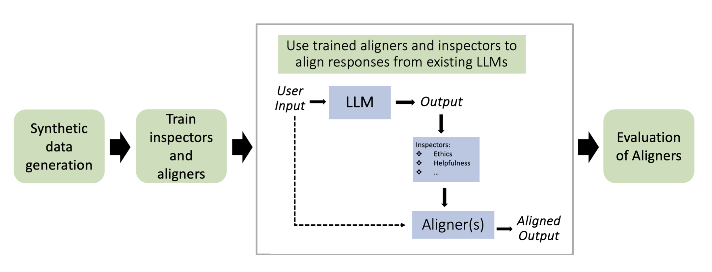

# Aligners
This repository contains code for the paper [Aligners: Decoupling LLMs and Alignment](https://arxiv.org/pdf/2403.04224)



# 1. Synthetic data generation
## Instructions

- Navigate to the ```./synthetic-data-generation``` folder and then open either the ```ethical```, ```factuality```, or ```helpful``` folder depending on the type of dataset you are trying to generate.

- Adapt the code in ```generate_topics.py``` to the model and model source that you are going to be using. The provided code uses ```Falcon-40B``` through [IBM Foundation Models Studio](https://ibm.github.io/ibm-generative-ai/v3.0.0/getting_started.html). If you want to use ```Falcon-40B``` through Hugging Face, change the code accordingly.
  
- Run ```generate_topics.py``` using the command ```python generate_topics.py``` to generate topics.
  
- In ```deduplicate_topics.py```, provide a path to the file that contains generated topics in the ```main``` function's ```data_file``` parameter.
  
- Run ```deduplicate_topics.py``` using the command ```python deduplicate_topics.py``` to filter out invalid and duplicated topics.

- Adapt the code in ```generate_questions.py``` to the model and model source that you are going to be using. The provided code uses ```Falcon-40B``` through [IBM Foundation Models Studio](https://ibm.github.io/ibm-generative-ai/v3.0.0/getting_started.html). If you want to use ```Falcon-40B``` through Hugging Face, change the code accordingly.
  
- Run ```generate_questions.py``` using the command ```python generate_questions.py``` to generate questions (```x```).

- Create a CSV file of generated questions by running the ```json-to-df.ipynb``` jupyter notebook. The CSV file will be saved in the ```questions``` folder.

- Adapt the code in ```generate-bad-and-good-responses.ipynb``` to the model and model source that you are going to be use. The provided code uses ```Falcon-40B``` through [IBM Foundation Models Studio](https://ibm.github.io/ibm-generative-ai/v3.0.0/getting_started.html). If you want to use ```Falcon-40B``` through Hugging Face, change the code accordingly.

- Generate misaligned (```y```) and aligned (```y'```) responses to every question (```x```) by running the ```generate-bad-and-good-responses.ipynb``` jupyter notebook.

- Clean data for inspector and aligner training by running the ```clean-data-for-inspector-and-aligner-training.ipynb``` notebook to filter out bad samples.


# 2. Train inspectors and aligners
## Instructions

After generating synthetic data in step 1, train inspectors and aligners as follows:

- To train inspectors, navigate to the ```./inspector-training``` folder and run the ```train_inspectors.sh``` bash script.
  
- To train aligners, navigate to the ```./aligner-training``` folder and train GPT-2 Large, Pythia-1.4B, RedPajama-3B, and Phi-2 aligners by running ```train_aligners_gpt2.sh```, ```train_aligners_pythia.sh```, ```train_aligners_redpajama.sh```, and ```train_aligners_phi2.sh``` bash scripts, respectively.

NOTE: Adapt the bash scripts to the system/cluster that you are using to specify the number of nodes, GPUs, etc. Example bash scripts for when you are running on a cluster that uses a Slurm job scheduler are in the ```./aligner-training``` folder.


# 3. Generate responses for evaluation using aligners squad and baseline models
## Instructions

After training inspectors and aligners in step 2, generate responses using the trained aligners *squad* and baselines for evaluation as follows:

- Navigate to the ```./generate-responses-for-eval``` folder.

- Create synthetic data (```synthetic_mixed```) made of ethical, factuality, and helful test questions ```(x)``` (5000 samples each) and put it in ```./test_data_x``` by following the naming convention ```{data_name}_test_inputx.csv``` i.e. ```synthetic_mixed_test_inputx.csv```.

- Run the Jupyter notebook ```beaver_tails_data_prep.ipynb``` to download the BeaverTails evaluation dataset from Hugging Face, extract questions ```(x)``` from it, and save it as a csv file in ```./test_data_x```.

- Adapt the code in ```generate_responses_using_llms_baselines.py``` to the models (LLMs) source that you are going to be using. The provided code uses LLMs accessed through the [IBM Foundation Models Studio](https://ibm.github.io/ibm-generative-ai/v3.0.0/getting_started.html). If you want to use models from Hugging Face, change the code accordingly.

- To generate responses using ```falcon-40b```, ```llama-2-13b-chat```, ```llama-2-70b-chat```, ```falcon-40b-instruct```, ```llama-2-13b```, and ```llama-2-70b```, run the bash script ```run_generate_responses_using_llms_baselines.sh```. Data with the generated responses will be found in ```./data_unaligned```.

- To generate responses using the aligner by Ji et al., run the bash script ```run_generate_using_Ji_et_al_aligner.sh```. Data with generated responses will be saved in the ```./data_aligned``` folder. Note: In the code, we sometimes refer to the aligner by Ji et al. as the PKU aligner.

- To generate responses using individual aligners, run the bash script ```run_generate_using_individual_aligners.sh```. Data with generated responses will be saved in the ```./data_aligned_individual``` folder.

- Provide a path to saved inspector checkpoints in the ```generate_responses``` function in ```generate_using_aligners_squad.py``` and if you are using a checkpoint id for aligners that is different from ```2500```, change it under ```if __name__ == "__main__":``` in ```generate_using_aligners_squad.py```.

- To generate responses using the aligners *squad*, run the bash script ```run_generate_using_aligners_squad.sh```. Data with generated responses will be saved in the ```./data_aligned``` folder.

  NOTE: In cases where GPUs are needed to run, adapt the bash scripts to the system/cluster that you are using to specify the number of GPUs. Some example bash scripts for when you are running on a cluster that uses a Slurm job scheduler are in the ```./generate-responses-for-eval``` folder.


### Preparing data for evaluation using GPT-4 via AlpacaEval 2.0
- To convert the test data into a format expected for evaluation using GPT-4 via AlpacaEval, run bash scripts ```run_data_prep_for_alpaca_eval.sh``` and ```run_data_prep_for_alpaca_eval_our_aligners_vs_Ji_et_al_aligner.sh```. The converted data will be found in ```./data_for_alpaca_eval```.


# 4. Evaluation

Coming soon ...


